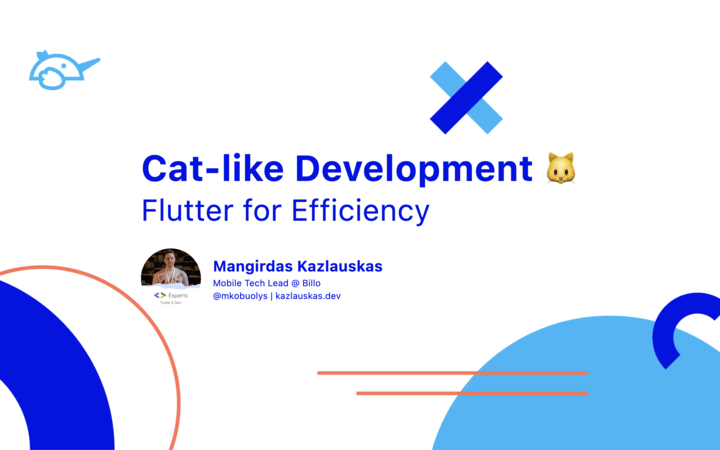

# Cat-like Development: Flutter for Efficiency



A presentation from [Fluttercon Europe 2024](https://fluttercon.dev/) 💙

Powered by [flutter_deck](https://pub.dev/packages/flutter_deck) 🚀

Deployed on [kazlauskas.dev](https://kazlauskas.dev/ldd) 🎉

---

## Building

You can follow these instructions to build the slides and run them locally.

### Prerequisites

If you are new to Flutter, please first follow the [Flutter Setup](https://flutter.dev/setup/) guide.

### Building and running the slides

To build and run the slides, run the following commands:

```
git clone git@github.com:mkobuolys/ldd.git
cd ldd
flutter pub get
flutter run
```

The `flutter run` command both builds and runs the Flutter app on your device, browser or emulator.

For the best experience, use the macOS build with the `--release` flag:

```
flutter run -d macos --release
```
